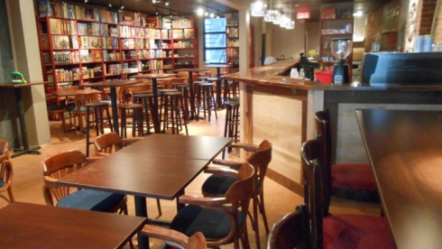

## description

Récemment ouvert dans le quartier d'Hochelaga, l'Adversaire est avant tout un lieu d'échanges : entre les usager.e.s, venu.e.s tester de nouveaux jeux autour d'un verre, mais aussi avec les salarié.e.s, expert.e.s en jeux de société. Ouverture d'esprit, collaboration : plaisir garanti.

